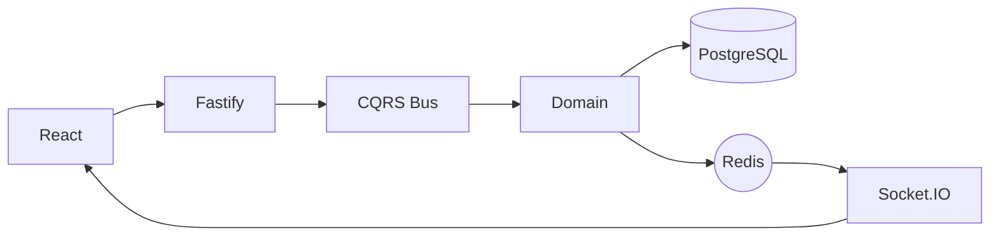

# Real-Time Chat Platform

A scalable, event-driven chat system built with **TypeScript**, **Clean Architecture**, and **CQRS**.

This project demonstrates a production-style backend with real-time communication, strict domain boundaries, and horizontal scalability.

---

## Tech Stack

### Backend

- Node.js (Fastify)
- TypeScript
- Awilix (DI)
- PostgreSQL
- Drizzle ORM

### Real-Time

- Socket.IO
- Redis Pub/Sub

### Frontend

- React
- Tailwind CSS
- shadcn/ui

### Monorepo

- Nx
- pnpm

---

## Architecture



Key Features
CQRS – separate command and query flows

Domain Events – event-driven core

Type Safety – shared domain types with Zod

Horizontal Scaling – Redis Pub/Sub for real-time fan-out

## Quick Start

```bash
git clone https://github.com/ThanhDang13/chat
cd chat
pnpm install
cp .devcontainer/.env.example .env
docker compose -f .devcontainer/docker-compose.yaml up -d
pnpm -F api drizzle:push
pnpm nx run-many --target=serve --all --parallel
```

API: http://localhost:3000 or http://localhost/api

Web: http://localhost:4200 or http://localhost

## Project Status

This repository is an **architectural reference** and a **learning milestone**.  
It demonstrates advanced backend patterns and serves as the foundation for my work in **distributed systems**.

## License

MIT
