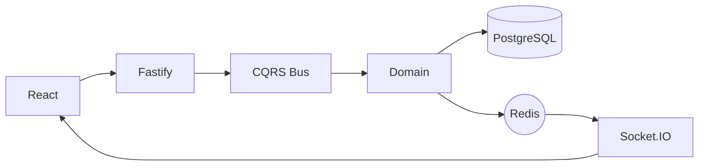

# Real-Time Chat Platform

A scalable, event-driven chat system built with **TypeScript**, **Clean Architecture**, and **CQRS**.

This project demonstrates a production-grade backend with real-time communication, strict domain boundaries, and horizontal scalability.  
The **UI and core features are inspired by modern messaging platforms such as Facebook Messenger**, including real-time message delivery, conversations, typing indicators, and presence.

The system is designed to handle high concurrency, ensure message consistency, and support future extensions such as read receipts, reactions, and media messaging.

## Preview

### Home

| Light                                        | Dark                                       |
| -------------------------------------------- | ------------------------------------------ |
| .png>) | .png>) |

### Chat

| Light                                        | Dark                                       |
| -------------------------------------------- | ------------------------------------------ |
| .png>) | .png>) |

### Chat Details

| Dark                                                       |
| ---------------------------------------------------------- |
| .png>) |

### Profile

| Light                                              | Dark                                             |
| -------------------------------------------------- | ------------------------------------------------ |
| .png>) | .png>) |

---

## Tech Stack

### Backend

- Node.js (Fastify)
- TypeScript
- Awilix (DI)
- PostgreSQL
- Drizzle ORM

### Real-Time

- Socket.IO
- Redis Pub/Sub

### Frontend

- React
- Tailwind CSS
- shadcn/ui

### Monorepo

- Nx
- pnpm

---

## Architecture



Key Features
CQRS – separate command and query flows

Domain Events – event-driven core

Type Safety – shared domain types with Zod

Horizontal Scaling – Redis Pub/Sub for real-time fan-out

## Quick Start

```bash
git clone https://github.com/ThanhDang13/chat
cd chat
pnpm install
cp .devcontainer/.env.example .env
docker compose -f .devcontainer/docker-compose.yaml up -d
pnpm -F api drizzle:push
pnpm nx run-many --target=serve --all --parallel
```

API: http://localhost:3000 or http://localhost/api

Web: http://localhost:4200 or http://localhost

## Project Status

This repository is an **architectural reference** and a **learning milestone**.  
It demonstrates advanced backend patterns and serves as the foundation for my work in **distributed systems**.

## License

MIT
